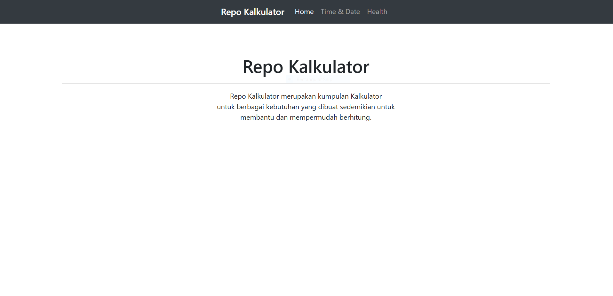

# Repo Kalkulator

Repo Kalkulator adalah kumpulan kalkulator sederhana untuk mempermudah dalam menghitung kebutuhan seperti waktu, umur bahkan berat badan.

Kumpulan kalkulator ini merupakan project sederhana dari proses belajar saya selama 181 hari untuk menjadi seorang Backend Developer.
Bahasa yang saya gunakan adalah PHP Native.

## Jenis-jenis Kalkulator

### Kalkulator Time & Date

- Kalkulator Umur
- Kalkulator Kalkulator Hari
- Kalkulator Durasi Waktu

### Kalkulator Health

- Kalkulator BBI (Berat Badan Ideal)

## Hasil Tampilan

## TAMPILAN BERANDA REPO KALKULATOR

 <!-- Ganti dengan path ke gambar beranda Anda -->

## TAMPILAN KALKULATOR UMUR

 <!-- Ganti dengan path ke gambar kalkulator umur Anda -->

## TAMPILAN KALKULATOR HARI

## TAMPILAN KALKULATOR DURASI WAKTU

## TAMPILAN KALKULATOR BBI

